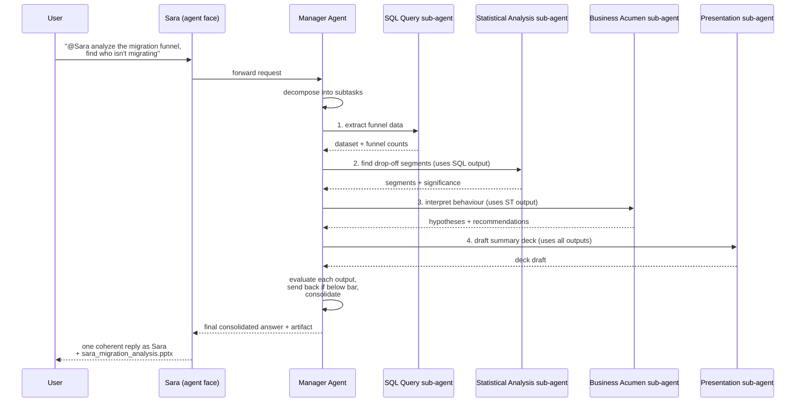
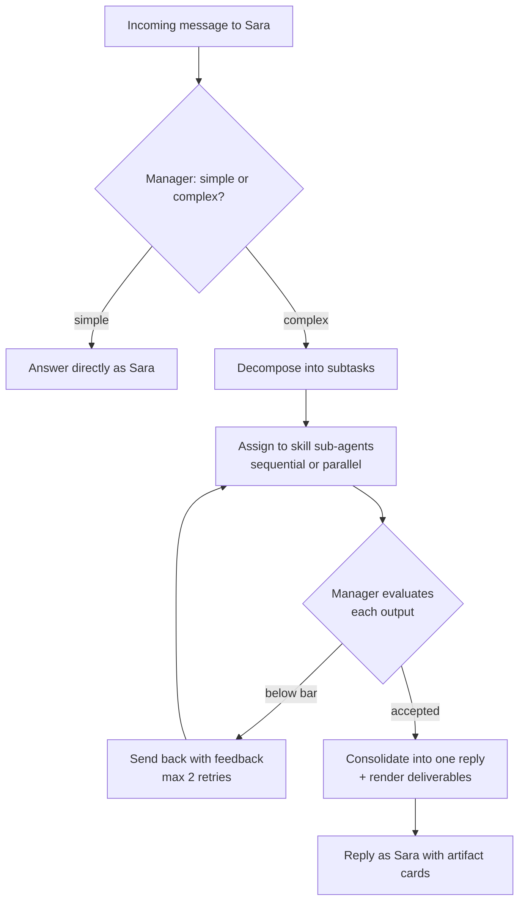
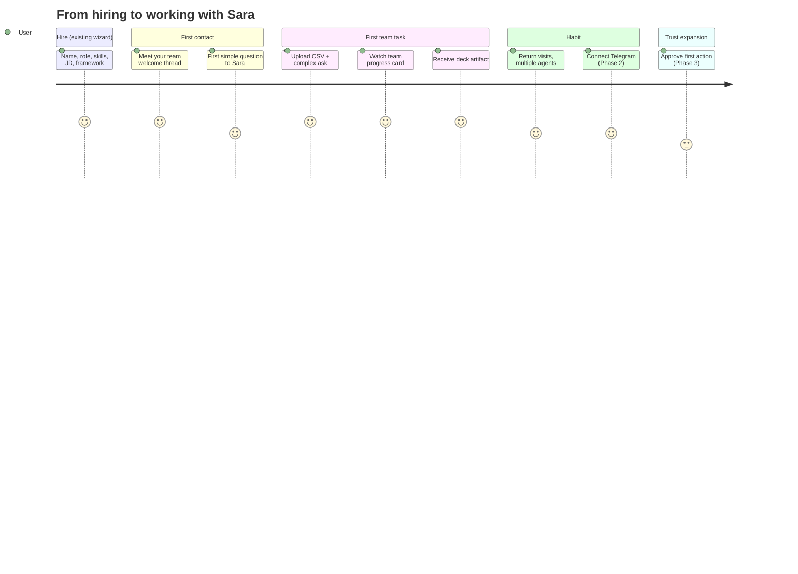
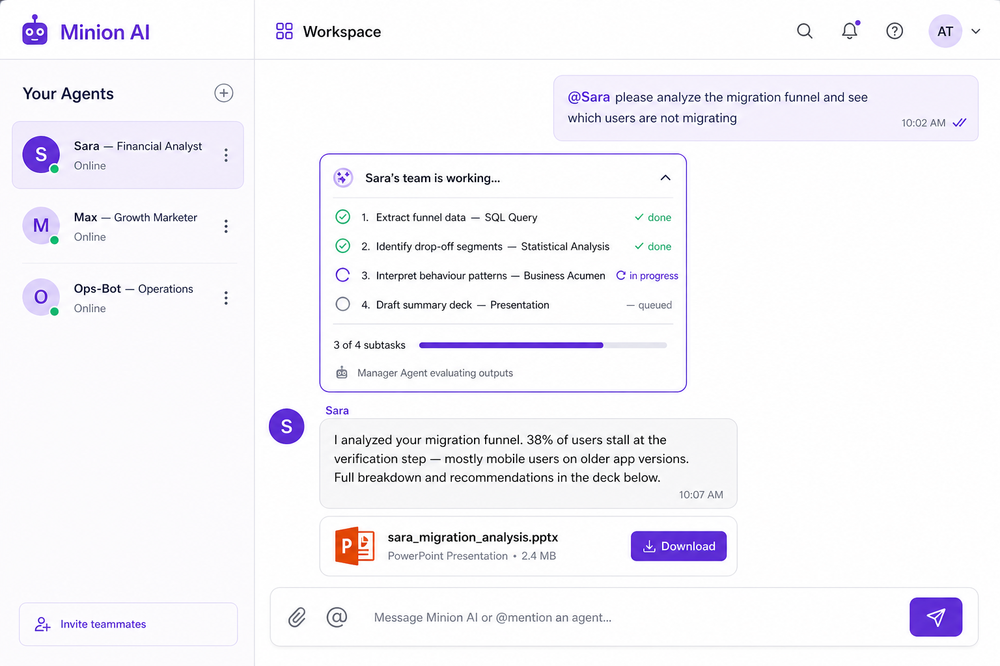
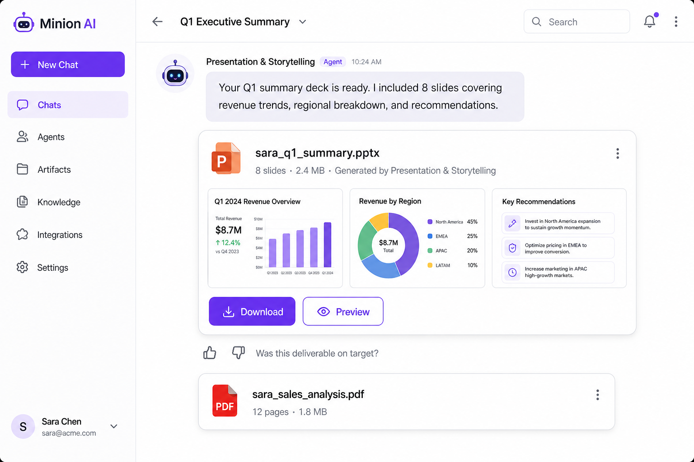
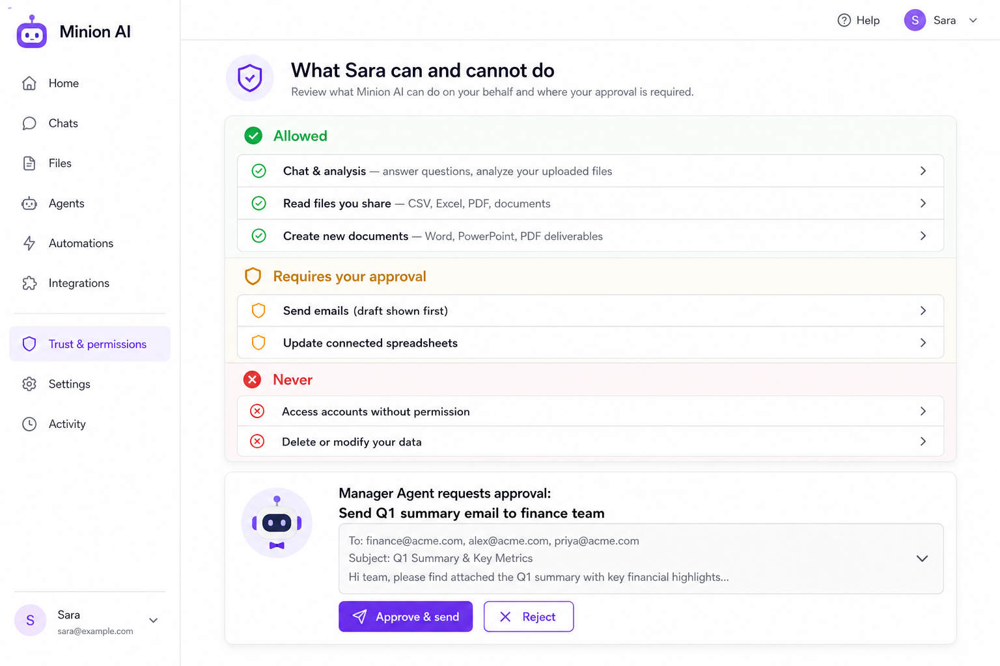
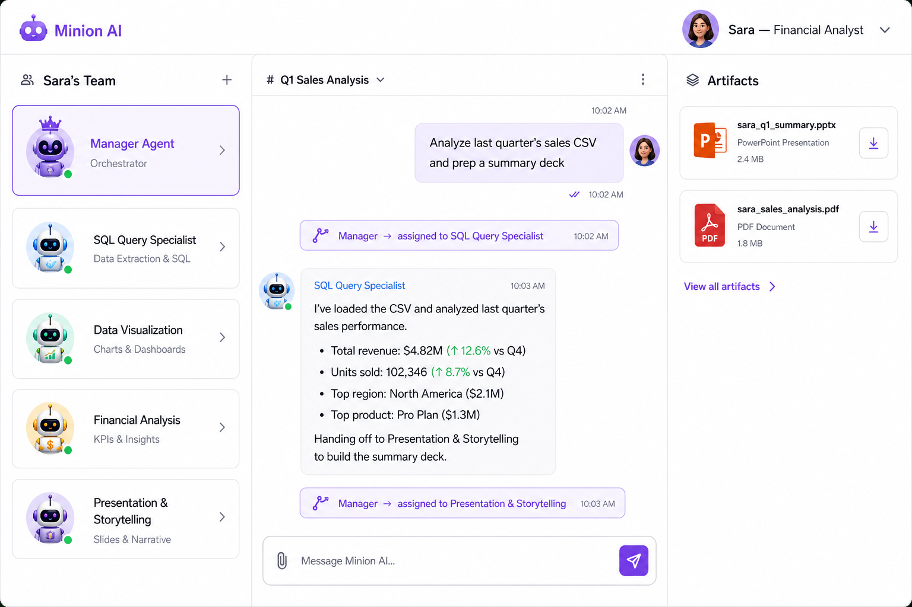

# Agent Experience Design — Working With Your AI Employees

> Companion to [agent-usage-strategy.md](agent-usage-strategy.md) (strategy, phases, pricing) and [product-spec.md](product-spec.md) (creation flow).
> Status: Draft v1 — June 2026. Screens are design intent, not implemented UI.

---

## 1. The interaction model

**One face, a whole team behind it.** The user talks to a named agent (Sara) exactly like a manager messages a direct report. Internally, Sara is a coordinated team: a manager agent decomposes the request, skill sub-agents collaborate on subtasks, and the manager evaluates and consolidates before replying as Sara.

Key properties:

1. **Sequential context passing** — each sub-agent receives the upstream sub-agent's output, not just the original prompt. This is the "super skill": SQL → stats → interpretation → deck is one pipeline, not four isolated answers.
2. **Evaluation gate** — the manager reviews every sub-agent output against the subtask brief before it flows downstream; substandard output goes back with feedback (max 1–2 retries, then proceed with a caveat noted).
3. **Single voice** — the user never reads four bot messages. The consolidation step writes one reply in Sara's voice, with the deliverable attached.
4. **Complexity routing** — trivial messages ("@Sara what does churn mean?") skip the pipeline entirely; the manager answers directly as Sara. Only genuinely complex asks fan out (this also controls inference cost — see strategy doc, unit economics).

---

## 2. End-to-end user journey

| Stage | Moment that matters | Design requirement |
|-------|---------------------|--------------------|
| Post-creation | "Meet your team" — Sara introduces herself and her sub-agents in the first thread | Auto-generated welcome message listing capabilities, with 3 suggested starter tasks tailored to the JD |
| First simple chat | Instant answer in Sara's voice | No visible pipeline for simple Q&A — speed is the feature |
| First team task | The progress card appears, then a deliverable lands | This is the conversion "aha"; must complete in minutes, not silently hang |
| Return visit | Workspace remembers threads per agent | Thread history, pinned artifacts |
| Multi-agent | @-mention switching feels like Slack DMs | Mention autocomplete, per-agent avatar/colors |

---

## 3. Chat workspace — screen design

### Layout (desktop)

| Region | Contents |
|--------|----------|
| Left sidebar — "Your Agents" | Slack-style agent list: avatar, name, role ("Sara — Financial Analyst"), online dot, unread badge. "+" opens the existing creation wizard. Invite teammates entry (Team tier). |
| Main thread | Conversation with @-mentions; user bubbles right, agent replies left with the agent's avatar and name. Team progress cards and artifact cards render inline in the thread. |
| Composer | Text input with paperclip (file upload), @ (mention picker), send. Drag-and-drop anywhere in the thread uploads to the conversation. |

Mobile collapses the sidebar to a top agent-switcher; everything else is the thread.

### The team progress card

Appears in-thread the moment the manager decides a request is a team task:

- **Collapsed (default):** "Sara's team is working… 3 of 4 subtasks" + progress bar. Non-technical users get reassurance without noise.
- **Expanded:** the decomposed task list — subtask name, owning sub-agent, status (queued / in progress / done / revising), and "Manager Agent evaluating outputs" footer. Power users watch the framework they built actually collaborate.
- On completion the card collapses into a small "Completed by Sara's team — 4 subtasks · 2 min" receipt above the reply, expandable forever (auditability).

Design rule: **the card is the only place teamwork is visible.** Sub-agents never post messages into the thread themselves — one face, one voice.

### Multi-agent mentions

- `@Sara`, `@Max` autocomplete from the user's roster; each agent has a distinct avatar color.
- A thread can address multiple agents; each request routes to that agent's own manager pipeline. Agents do not talk to each other in v1 (cross-agent collaboration is a future concept, noted in §7).

---

## 4. File input UX (read capability, L1)

- Drop or attach CSV / Excel / PDF / Word into the composer; the file chip shows name + size before sending.
- Sara acknowledges receipt in her reply and the manager makes the file available to whichever sub-agents need it ("SQL Query is reading `q1_users.csv`" inside the progress card).
- Files are conversation-scoped: visible in a "Files" tab of the thread, re-usable in later requests without re-upload.
- Read-only, always: uploaded files are inputs; agents create *new* artifacts, never mutate uploads.

---

## 5. Document output UX

- Deliverables arrive as **artifact cards** inline under Sara's reply: file icon (PPT orange / Word blue / PDF red), filename, metadata ("8 slides · 2.4 MB · by Sara's team"), slide/page thumbnails when renderable, **Download** (primary) and **Preview** (secondary).
- Naming follows the existing convention: `{agent_name}_{deliverable}.pptx` (e.g. `sara_migration_analysis.pptx`) — consistent with `sara_skill.md` / `sara_agent_framework.json`.
- A feedback row under each artifact ("Was this deliverable on target?" 👍/👎) feeds the data flywheel (decomposition + template quality signals — see strategy doc §6).
- All artifacts for an agent also collect on the agent's dashboard card next to the existing skill/framework downloads.

---

## 6. Safety & trust surface

- **"What Sara can and cannot do" panel**, one click from the workspace header. Three bands: **Allowed** (chat & analysis, read shared files, create new documents), **Requires your approval** (Phase 3: send emails, update connected sheets), **Never** (access accounts without permission, delete or modify your data).
- The panel is static truth in Phase 1 (everything is L0/L1) and becomes interactive in Phase 3, where each approval-gated capability shows its connector, scope, and a revoke control.
- **Approval request pattern (Phase 3):** the manager agent posts an approval card in-thread — what it wants to do, a full preview (e.g. the drafted email), **Approve & send** / **Reject**. No "always allow" for destructive verbs in v1. Every decision lands in the audit log.
- Microcopy principle: capabilities are described in job terms ("send emails"), never in technical terms ("SMTP access").

---

## 7. Behind-the-scenes view (power users) and future concepts

- An optional **"Team view"** of an agent (from the agent's profile) shows the full roster — manager + each skill sub-agent with its skill.md — and a feed of recent task assignments. This is the grown-up version of today's framework preview: the org chart, running.
- **Future concepts (not in Phase 1–3 scope):**
  - *Cross-agent collaboration:* @Sara and @Max jointly on one task (two managers negotiating a shared breakdown).
  - *Standing tasks:* "every Monday, send me the funnel report" — scheduled team tasks.
  - *Skill marketplace:* import community skill.md files into an agent's team; the manager learns when to use them.

---

## 8. Design principles summary

1. **One face, one voice** — teamwork is visible in the progress card only; the reply is always a single, consolidated message from the named agent.
2. **Effort where it's earned** — simple questions answer instantly; the pipeline (and its visible card) appears only for complex tasks.
3. **Deliverables over chat** — success is a downloaded file, not a long thread; the artifact card is the hero component.
4. **Manager as quality and safety gate** — evaluation-before-consolidation and approval-before-action are the same muscle.
5. **Corporate familiarity** — @-mentions, direct reports, progress updates, sign-offs: borrow the mental model users already have at work.
