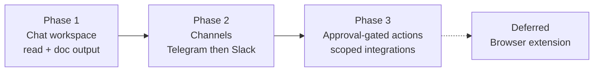
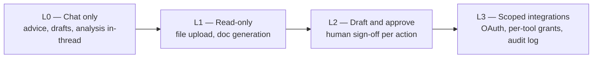
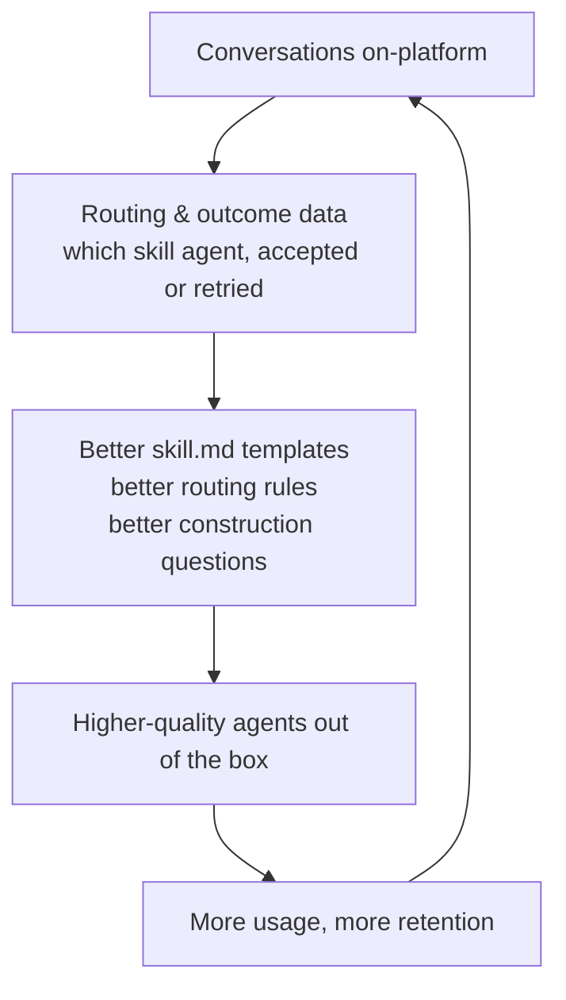

# Agent Usage Strategy — How Users Work With Their Agents

> Companion to [product-spec.md](product-spec.md) (creation flow) and [agent-experience-design.md](agent-experience-design.md) (screen-level design).
> Status: Draft v1 — June 2026

---

## 1. Vision & positioning

**"Hire, onboard, and work with your AI team."**

Minion AI already nails the first two verbs: a non-technical user *hires* an agent through a familiar, HR-like flow (name, role, seniority, skills → job description → skill breakdown → multi-agent framework). The strategic gap is the third verb: **work with**.

Today the output is a config file (`{name}_skill.md` + `{name}_agent_framework.json`). The user downloads it and takes it elsewhere. That makes Minion a *generator*, not a *workplace*. This document defines how the agent team becomes a live workspace the user returns to daily.

**Positioning statement:** Minion AI is where non-technical professionals build and work with AI employees — without prompts, code, or integrations knowledge. Each agent (e.g. **Sara**) is a *team-in-a-box*: the user talks to one named colleague, and behind that face a manager agent decomposes the request, multiple skill sub-agents collaborate on it, and the manager evaluates and consolidates before replying as Sara. The hiring metaphor isn't onboarding polish; it is the product.

**The core differentiation — skill synergy.** Skill.md files are already commonplace (Claude skills, custom GPT instructions). What the market lacks is *composition*: skills working together on one task the way a real team does. "@Sara, analyze the migration funnel and find who isn't migrating" is not one skill — it's SQL extraction → statistical analysis → business interpretation → presentation, chained and quality-checked. Minion's orchestration layer turns isolated skills into a **super skill**, and that is the moat single-persona chatbots can't replicate with a system prompt.

---

## 2. Options considered

| # | Option | Verdict |
|---|--------|---------|
| 1 | Download framework + skill.md, run elsewhere (current) | **Keep as feature, not core.** Zero risk and builds trust ("your agent is portable"), but all value accrues to the destination platform. No usage data, no retention, no defensible pricing. |
| 2 | In-platform chat workspace | **Core experience — Phase 1.** The framework JSON becomes a runtime spec; every conversation is owned data; prerequisite for every other option. |
| 3 | Browser extension (screen-aware sidekick) | **Deferred.** Highest build cost, hardest privacy story for a non-technical audience, and the worst surface for "executed wrongly" risk. Revisit only with proven retention and a concrete use case. |
| 4 | Messaging channels (Telegram, Slack, WhatsApp, Teams) | **Phase 2.** Distribution where users already live. Thin clients over the Phase 1 backend — there is nothing to connect to until the chat backend exists. Telegram first (free, instant approval), Slack second, WhatsApp/Teams later (cost/approval/enterprise friction). |

---

## 3. Phased roadmap

### Phase 1 — Chat workspace (the product becomes real)

The user opens a chat workspace and talks to their agents the way a manager talks to direct reports — one thread, @-mentions, complex asks.

- **One face, a whole team behind it.** The user writes *"@Sara please analyze the migration funnel and see which users are not migrating."* On the backend, Sara's manager agent decomposes the task, assigns subtasks to skill sub-agents (SQL extracts the funnel data → statistical analysis finds the drop-off segments → business acumen interprets why → presentation drafts the summary), evaluates each output, consolidates, and replies **as Sara** — one coherent answer, not four bot messages.
- **Visible teamwork, on demand.** While Sara works, the thread shows a collapsible progress card: the task breakdown, which sub-agent owns each subtask, and live status. Users who don't care see "Sara's team is working (3/4 subtasks done)"; users who do care can expand and watch the framework they built actually collaborate. This is the payoff of the creation wizard — the org chart runs.
- **Multi-agent chat, corporate-style.** Users with several agents @-mention whichever one fits ("@Sara analyze this", "@Marketing-Max draft the launch email") in the same workspace — exactly like addressing different team members in Slack.
- **Read capability (L1).** Users drop in files — CSV, Excel, PDF, docs — and sub-agents analyze them. No write access to anything.
- **Document output.** Deliverables come back as real files: Word documents, PowerPoint decks, PDFs — rendered server-side and delivered as artifact cards in the thread (named `{agent_name}_{deliverable}.docx`, consistent with existing artifact naming). This is the moment the agent feels like a hire, not a chatbot: it hands you a finished deck.
- **Downloads stay.** Export of skill.md / framework JSON remains one click away — portability is a trust feature and a differentiator versus walled gardens.

Success metric: % of created agents with ≥3 chat sessions in week 1; documents generated per active agent; % of tasks requiring ≥2 sub-agents (proof the synergy layer is used).

### Phase 2 — Channels (meet users where they are)

- **Telegram bot** first: free API, no approval process, ideal for the prosumer segment. `/talk sara` → same manager routing, same skill agents, doc artifacts delivered as files.
- **Slack app** second: unlocks team/work contexts and is the bridge to B2B pricing.
- **WhatsApp / Teams** later: WhatsApp Business API has per-conversation costs and approval gates; Teams implies enterprise sales motion. Add when revenue justifies.

Channels are thin: they reuse the Phase 1 orchestration backend and conversation store. One brain, many mouths.

Success metric: % of weekly-active agents reachable via ≥1 external channel; retention delta for channel-connected users.

### Phase 3 — Approval-gated execution (graduating from advisor to operator)

- **Draft-and-approve pattern:** the agent prepares the action (email draft, spreadsheet update, CRM entry, scheduled report) and the user approves with one click. Nothing side-effectful happens without explicit human sign-off.
- **Scoped OAuth connectors:** Google Sheets/Drive, Gmail send-as-draft, Notion — each grant is per-agent, per-scope, revocable, and visible in a permissions panel.
- **Audit log:** every action proposed, approved, rejected, executed — timestamped and reviewable.

Success metric: approved actions per active agent; % of approvals without edits (proxy for trust and agent quality).

### Deferred — Browser extension

Reconsider only if Phase 1–2 data shows a recurring "agent needs to see what I see" use case (e.g. analysts living in a BI tool). The screen-capture privacy story and extension review overhead are not justified by current evidence.

---

## 4. Risk framework — the capability ladder

The fear scenario ("agent connects to a database and deletes everything") conflates *execution* with *unscoped execution*. Capability is granted in levels, and the manager agent is the enforcement point:

| Level | Destructive risk | Phase | Notes |
|-------|------------------|-------|-------|
| L0 chat | None | 1 | Pure inference |
| L1 read + doc output | None — generated files are new artifacts, never mutations of user systems | 1 | Covers ~80% of target-persona value (analyses, reports, decks) |
| L2 approve-to-act | Low — human approves every side effect | 3 | Approval UX is a *selling point* for non-technical users, not a tax |
| L3 scoped connectors | Managed — least-privilege OAuth scopes, no raw credentials, revocable | 3 | Never ask for database passwords; read-only connectors by default |

Design principles:

1. **The manager agent is the safety layer.** It already decomposes, assigns, and evaluates every subtask — so it is also the natural choke point for side effects: it produces the approval request, never the execution directly. Evaluation-before-consolidation doubles as risk review.
2. **No raw credentials, ever.** OAuth scopes only; default scopes read-only.
3. **Asymmetric defaults.** Reading and creating new artifacts: allowed. Modifying or deleting anything outside Minion: requires explicit approval, every time (no "always allow" for destructive verbs in v1).
4. **Visible permissions.** Each agent card shows "what this agent can / cannot do" — see design doc.
5. **Audit log from day one of L2.** Trust is retroactive: users check the log after the fact.

---

## 5. Pricing model

### Why usage-based beats export-only

The current export model monetizes one moment (creation) and then loses the user to Claude/ChatGPT. Hosting the conversation flips this: costs scale with usage (Anthropic inference), so should revenue — and the usage data compounds product quality (Section 6).

### Comparator anchors (June 2026)

| Product | Individual | Team |
|---------|-----------|------|
| ChatGPT Plus / Team | $20/mo | $25–30/user/mo |
| Claude Pro / Team | $20/mo | $25–30/user/mo |
| Microsoft Copilot Pro / M365 Copilot | $20/mo | $30/user/mo |
| Manus | $20/mo (4,000 credits) – $40/mo (8,000) | $20/seat/mo |
| Lindy AI (no-code workflows) | $49/mo | — |

The prosumer reference price is **$20/mo**; agent platforms with execution (Manus, Lindy) sustain **$40–49/mo**. Minion's differentiation (structured team + document deliverables) supports the upper band once doc output ships.

### Proposed structure

| Tier | Price | Includes | Phase |
|------|-------|----------|-------|
| **Free** | $0 | Create up to 2 agents, unlimited simple chat (fair use), 5 team tasks/mo, downloads (skill.md + framework JSON), watermarked doc output | 1 |
| **Pro** | $29/mo | Unlimited agents, ~150 team tasks/mo fair use, unlimited simple chat, unlimited doc generation (Word/PPT/PDF), Telegram channel | 1–2 |
| **Team** | $39/user/mo | Everything in Pro + Slack, shared agents, admin controls, audit log | 2–3 |
| **Add-on: Actions** | usage-metered | L2/L3 approved actions and connectors | 3 |

A **team task** = a request the manager agent decomposes across ≥2 sub-agents (the synergy pipeline). Simple Q&A stays effectively unmetered.

Rationale:

- **Free tier keeps the viral creation loop** (the wizard is the acquisition magnet) while watermarked docs and the team-task cap create natural upgrade pressure — users hit the cap exactly when they're getting the differentiated value.
- **$29 sits above the $20 chat herd** — justified because the user gets a *team* that produces *files*, not a single chatbot. Below Manus's $40 tier to win switchers.
- **Team tasks are the metered unit because they're the value unit.** The first time Sara hands back a finished deck from a one-line ask is the "aha" — and it maps 1:1 to the highest-cost inference pipeline, protecting margin without Manus-style "credit anxiety" (a documented complaint with credit models).

### Unit economics sketch

Cost per task scales with complexity: a simple Q&A is one inference call (~$0.01–0.03, Sonnet-class), while a full decompose → multi-sub-agent → evaluate → consolidate pipeline is 4–8 calls (~$0.05–0.20). This argues for **task-tiered metering**: simple messages cheap/uncounted, "team tasks" (multi-sub-agent pipelines) as the metered unit — which also maps cleanly to perceived value (a team task returns a deliverable). A Pro user at ~150 team tasks + ordinary chat lands at $10–35/mo inference cost at list prices; margin depends on prompt caching, routing trivial subtasks to smaller models, and median usage far below ceiling (industry pattern: median ≪ cap). Doc rendering is negligible compute. Target blended gross margin: 60–70% at scale.

---

## 6. Data flywheel & moat

What the platform learns only if chat is hosted:

- **Decomposition quality:** how the manager breaks complex tasks into subtasks, and which breakdowns lead to accepted results vs. re-asks ("no, I meant…"). This is the rarest dataset in the market — nobody else captures *task decomposition for professional work* at scale.
- **Collaboration patterns:** which skill chains recur per profession (SQL → stats → narrative for analysts; modeling → valuation → memo for finance) → pre-built "super skill" pipelines that make new agents good on day one.
- **Skill gaps:** subtasks no sub-agent covers → new skill patterns for `skill_framework.py` inference and new wizard bubbles.
- **Template quality:** which generated skill.md specs produce outputs the manager accepts first-pass vs. sends back for revision.
- **Deliverable demand:** which doc types per field/role → pre-built deliverable templates per persona (a content moat competitors must replicate field by field).

Export-only forfeits all five. This is the strategic answer to "downloads make pricing weak": the moat is not the JSON file, it's the corpus of *how professional tasks decompose and which skill combinations complete them* — and that only accumulates on-platform.

Instrumentation already exists (`event_logger.py` / event table); Phase 1 adds conversation-level events (message routed, artifact generated, artifact downloaded, retry).

---

## 7. Market opportunity sizing

### Top-down (TAM)

- Global **AI agents market: $10.9–11.8B in 2026**, up from ~$7.9–8.0B in 2025; consensus CAGR **43–49% through 2030**, reaching **$47–57B by 2030** (Grand View Research, Precedence Research, BCC Research, MarketsandMarkets).
- Broader agentic-AI estimates that include foundation-model attribution put 2026 at **~$40B central ($33–48B range)** (Information Matters Q1 2026 agentic AI report).
- Demand signal: Gartner forecasts **40% of enterprise applications will embed task-specific AI agents by end of 2026**, up from <5% in 2025.

TAM relevant to Minion (application-layer agent platforms for knowledge work, excluding infrastructure/dev tooling): conservatively **$8–12B in 2026, growing ~45%/yr**.

### Bottom-up (SAM)

Minion's serviceable segment: **non-technical knowledge workers in analysis-heavy roles** (data/business analysts, finance/FP&A, marketing, operations) in English-speaking markets, who already pay for AI tools.

| Step | Estimate | Basis |
|------|----------|-------|
| Knowledge workers, US + UK + CA + AU + EU (English-working) | ~250M | OECD labor data, standard estimates |
| In target functions (analyst, finance, marketing, ops) | ~40M (~16%) | Occupational distribution |
| Already paying for ≥1 AI subscription (prosumer adopters) | ~8M (~20%) | AI subscription penetration among professionals, 2026 |
| **SAM at $29/mo blended ARPU** | **~$2.8B/yr** | 8M × $348/yr |

### Obtainable (SOM, 3-year)

| Scenario | Paying users | ARR |
|----------|--------------|-----|
| Conservative (0.1% of SAM users) | 8,000 | ~$2.8M |
| Base (0.5%) | 40,000 | ~$14M |
| Optimistic (1.5%, channel-led growth) | 120,000 | ~$42M |

Sensitivity: the single biggest lever is **Phase 2 channels** — Telegram/Slack distribution historically outperforms web-only acquisition for chat-native products, and Team-tier ($39/user) expansion raises blended ARPU above the $29 assumption.

### Honest caveats

- Market-size figures vary 4x across research firms depending on scope; the bottom-up SAM is the number to manage to.
- The $20/mo incumbents (OpenAI, Anthropic) can commoditize "chat with a persona" at any time; the defensible layer is the *structured team + profession-specific deliverable templates + accumulated design corpus*, not chat itself.

---

## 8. Competitive positioning

| Competitor | What they are | Why Minion wins the segment |
|------------|---------------|------------------------------|
| Claude Projects / custom GPTs / skill.md ecosystems | Single-persona chat with instructions; skills as isolated files | Skills exist but don't *cooperate* — one system prompt answers everything. No decomposition, no cross-skill handoffs, no evaluation step. Minion turns the same skill.md primitive into a coordinated team |
| Manus | Autonomous execution agent | Execution-first and credit-metered — powerful but opaque and anxiety-inducing for non-technical users; Minion's visible teamwork + approval gates is the trust-first inverse |
| Lindy AI / Zapier agents | No-code workflow automation | Workflow-builder mental model still too technical for the target persona; Minion's mental model is *managing a hire*, which everyone understands |
| CrewAI / LangGraph | Developer frameworks for agent collaboration | Validates the orchestration pattern Minion productizes — but not addressable by non-technical users at all |

**The wedge:** nobody else lets a non-technical professional hire a *named AI employee that is secretly a coordinated team* — @-mention Sara with a complex task, her manager decomposes it, skill sub-agents collaborate, the manager QAs and consolidates, and Sara replies with a finished deliverable. Skills are commodity; **skill synergy is the product**.

---

## 9. Decision summary

1. **Build the chat workspace (Phase 1) next** — chat + file read + Word/PPT/PDF output. No execution.
2. **Keep downloads** as a portability feature on every agent.
3. **Telegram, then Slack** as Phase 2 channels on the same backend.
4. **Execution only via approval gates** (Phase 3), never raw credentials; browser extension deferred indefinitely.
5. **Price at Free / $29 Pro / $39 Team**, metered fair-use messages, doc generation as the conversion event.
6. **Instrument everything from day one** — the moat is the usage corpus, not the artifact files.
