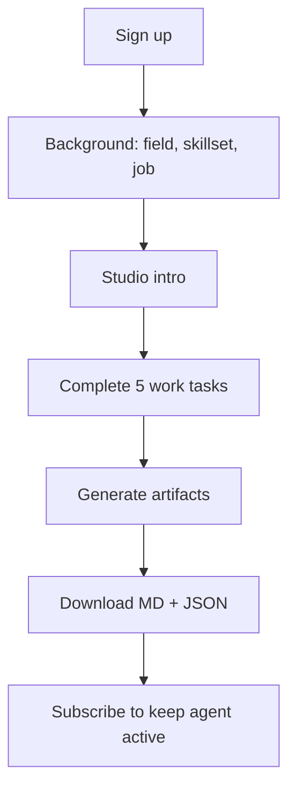

# Studio Design — How Training Works

## Concept

The **Studio** is an online assessment environment. Users complete realistic work tasks the way they would on the job. Their responses, timing, and revisions become the training signal for building:

1. **`agent-profile.md`** — human-readable description of how they think and work
2. **`agent-framework.json`** — multi-agent orchestration spec that simulates their workflow

## User journey

## Task types

| Type | Purpose | Captures |
|------|---------|----------|
| `scenario` | Metric investigation | Step order, reasoning, prioritization |
| `sql_challenge` | Technical execution | Query style, assumptions, edge cases |
| `interpretation` | Data → insight | Takeaways, recommendations, confidence |
| `communication` | Stakeholder updates | Structure, tone, issue flagging |
| `methodology` | Causal thinking | Method choice, tradeoffs, data needs |

## Data Analyst Studio (v1 template)

1. **Investigation: Revenue Drop** — ordered investigation steps + reasoning
2. **SQL: Weekly Active Users** — write query + note assumptions
3. **Interpret: Funnel Analysis** — takeaway, recommendation, confidence
4. **Communicate: Executive Summary** — email structure and tone
5. **Methodology: Feature Impact** — method choice for retention measurement

## Multi-agent framework output

The JSON framework defines:

- **Orchestrator** — routes intents to specialized agents
- **5 agents** — investigator, sql_analyst, interpreter, communicator, methodologist
- **Decision rules** — e.g. ambiguous metric → investigator → sql_analyst → interpreter → communicator
- **Style profile** — tone, confidence default, methodology default

Each agent's `system_prompt` is populated from the user's studio responses.

## Extending to other professions

Add new entries to `STUDIO_TEMPLATES` in `backend/services/studio_tasks.py` with profession-specific tasks. Background `field` value routes users to the matching template.

## Instrumentation events

- `background_completed`, `studio_started`, `studio_task_completed`, `studio_task_revised`
- `studio_completed`, `agent_artifacts_generated`
- `output_accepted` / `output_rejected` (future: post-generation feedback)
- Client-side: `signup_completed`, `studio_entered`, `studio_test_completed`
